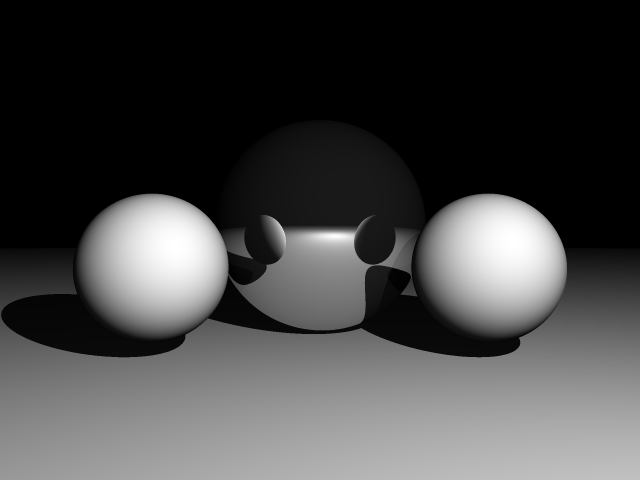

# Ray tracer

A program for drawing 3D mathematical functions using the ray tracing (ray marching) method. Written in C++.  
Created as a project for my Mathematical Modelling course.

## Installing prerequisites

This program has no dependencies. You only need `GCC` and `make` to compile it.

* Installing `GCC` and `make`:
	```bash
	sudo apt-get install build-essential
	```

## Compiling and running

Make sure to run the following commands in the base directory of the repository. The result will be stored as `render.bmp`.

* Compiling and linking the code:
	```bash
	make
	```
* Running the program:
	```bash
	build/raytracer
	```

## Examples



You can check out more rendered images [here](https://imgur.com/a/QpEdjfb "Render examples").
